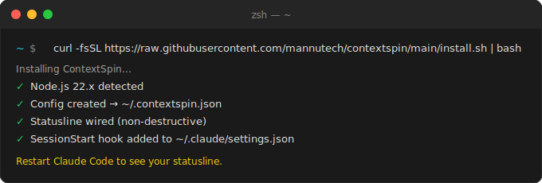

# ContextSpin

Live context in your Claude Code **status bar** — weather, the top Hacker News stories, fresh AI research papers, dev articles, PRs awaiting your review, CI failures, incidents, meetings — pulled from tools you already run. One-line install, and the bar is never empty.


*Your existing statusline stays on top; the ContextSpin line is composed beneath it — never replacing it.*

```bash
curl -fsSL https://raw.githubusercontent.com/mannutech/contextspin/main/install.sh | bash
```

Requires Node.js ≥ 18. MIT licensed. The only runtime dependency is [`commander`](https://www.npmjs.com/package/commander).




The bar is **never empty** — before you've wired anything (or when every source is quiet), it rotates through a built-in joke and onboarding hints:


## It does NOT fetch data

ContextSpin is a **renderer, not a data layer** — no API clients, no auth flows, no integrations of its own. It aggregates from sources you already have:

- **MCP servers** registered in `~/.claude.json` / `.mcp.json` (stdio only)
- **CLI tools** already installed and authed (`gh`, `kubectl`, `glab`, your scripts…)
- **HTTP endpoints** you can already reach

It formats whatever they return into one-line snippets and shows the most relevant one. If a tool you have can't reach the data, ContextSpin can't show it — by design.

## How it works (daemonless)

There is **no background process by default**. The statusline render is the engine — it serves the cached snippet instantly, and only when a source is past its cooldown does it spawn a detached one-shot refresh (lock-guarded so frequent renders never overlap). Nothing runs when you're not in Claude Code, so idle cost is zero.

```
  Claude Code draws the status bar
              │
              ▼
  RENDER  (~/.contextspin/statusline.mjs)
   1. read the cache, print one snippet NOW (stale is fine) ──► status bar
   2. if a source is due and no refresh is in flight:
              │
              ▼  (detached, non-blocking)
  REFRESH  (one-shot, src/refresh-entry.js)
   • run each DUE source, format, merge/dedup/prioritize, record lastRun
   • write ~/.contextspin-cache.json (atomic)
```

This is *stale-while-revalidate*: the bar is always fast, freshness catches up in the background. A legacy always-on daemon is still available behind `injection.daemonless: false` — only worth it for stdio MCP sources, where a persistent connection beats per-render handshakes.

## Install

```bash
curl -fsSL https://raw.githubusercontent.com/mannutech/contextspin/main/install.sh | bash
```

This wires a SessionStart hook into `~/.claude/settings.json` (so it self-heals each session), seeds a no-credentials starter pack (weather, a dad joke, top HN stories, AI research papers, dev articles, a daily quote), and wires your status bar **non-destructively** (any existing status line is preserved and composed above ours). Restart Claude Code to see it.

`npx contextspin install` does the same. `npx contextspin uninstall` removes everything. `npx contextspin status` shows the current snippets.

## Sources

Every source returns a list of records. Each record is optionally `filter`ed, then rendered with `format` using `{{ field }}` templating — dotted/bracketed paths work (`{{ results[0].value }}`), `{{ env.NAME }}` reads an environment variable, unknown fields render empty.

**`mcp`** — call a tool on a stdio MCP server discovered from your Claude config (JSON-RPC over stdin/stdout, no SDK):

```json
{ "type": "mcp", "tool": "slack_search_public", "args": { "query": "mentions:me is:unread" },
  "format": "Slack: {{ text }}", "label": "Slack", "cooldown": 300, "maxSnippets": 2 }
```

`tool` may be bare or `mcp__<server>__<tool>`; `server` is optional (otherwise the first stdio server exposing the tool is used).

**`cli`** — run a shell command (output parsed as a JSON array/object/primitive, or split into lines):

```json
{ "type": "cli", "command": "gh pr list --review-requested @me --json title,number --limit 3",
  "format": "PR #{{ number }} needs review: {{ title }}", "label": "GitHub", "cooldown": 120, "maxSnippets": 3 }
```

**`http`** — fetch a JSON or text endpoint:

```json
{ "type": "http", "url": "https://grafana.example.com/api/.../query?q=incidents",
  "headers": { "Authorization": "Bearer {{ env.GRAFANA_TOKEN }}" },
  "jq": ".results[0].value", "format": "Grafana: {{ value }}", "label": "Grafana", "cooldown": 30 }
```

`url` and headers are interpolated (use `{{ env.X }}` for secrets, never hard-code them). `jq` supports a minimal subset: identity, dotted keys, bracket indexing, iteration (`.[]`), and pipes.

## Configuration

One JSON file, `~/.contextspin.json` (override with `CONTEXTSPIN_CONFIG`); cache at `~/.contextspin-cache.json` (override with `CONTEXTSPIN_CACHE`).

```json
{
  "sources": [
    { "type": "cli", "command": "gh pr list --json title --limit 3", "format": "PR: {{ title }}" }
  ],
  "injection": { "mode": "statusline", "refresh": 30, "maxVisible": 20 },
  "snippets": { "deduplication": true, "cooldownAfterShown": 5, "priorityOrder": ["incident", "ci", "github"] }
}
```

| Field | Default | Meaning |
|-------|---------|---------|
| `sources[].type` | — | `mcp` \| `cli` \| `http` (required) |
| `sources[].tool` / `command` / `url` | — | Required for `mcp` / `cli` / `http` respectively |
| `sources[].format` | — | One-line `{{ field }}` template (required) |
| `sources[].filter` | — | Keep a record only if it passes (see below) |
| `sources[].label` | derived | Snippet source label (mcp→tool, cli→first token, http→host) |
| `sources[].cooldown` | `300` | Min seconds between polls of this source |
| `sources[].maxSnippets` | `2` | Max snippets kept per poll |
| `injection.refresh` | `30` | Status-bar refresh interval, seconds |
| `injection.maxVisible` | `20` | Cap on snippets held in the cache (rotated one at a time) |
| `injection.style` | `true` | Styled box (cyan bars + italic); `false` for plain text |
| `injection.daemonless` | `true` | Self-refreshing render; `false` for the legacy daemon |
| `injection.mode` | `statusline` | `statusline` \| `patcher` \| `both` |
| `snippets.deduplication` | `true` | Drop duplicate-text snippets when merging |
| `snippets.cooldownAfterShown` | `5` | A snippet stops showing after this many displays |
| `snippets.priorityOrder` | `[]` | Source labels sorted first (case-insensitive); rest last |

**Filters** are a single safe comparison (no `eval`): the expression is interpolated, then parsed as `LEFT OP RIGHT` where `OP` is `==`, `!=`, `>=`, `<=`, `>`, `<`, or `includes`. No `&&`/`||`.

```json
{ "filter": "{{ status }} == failure" }
```

## Cache

```json
{
  "updatedAt": "2026-06-17T09:00:00.000Z",
  "snippets": [
    { "text": "CI failing: build on main", "source": "CI", "sourceId": 2,
      "fetchedAt": "2026-06-17T09:00:00.000Z", "shownCount": 0 }
  ],
  "meta": { "lastRun": { "2": 1781860451773 } }
}
```

`shownCount` rises each time a snippet is shown; past `cooldownAfterShown` it's retired. `meta.lastRun` maps `sourceId → last poll (ms)` so the refresh honors per-source cooldowns across runs. When the cache is empty or every snippet is retired, the render rotates through built-in defaults (jokes + tips) — so the bar is never blank.

## CLI

| Command | What it does |
|---------|--------------|
| `install` | Wire the self-healing SessionStart hook, create config, wire the statusline (what the curl script runs). |
| `uninstall` | Remove the hook, restore your prior statusline in **every** scope, stop any daemon. |
| `status` | Show the engine and cached snippets. |
| `refresh` | Force a one-shot refresh of all due sources now. |
| `setup [--yes]` | Create `~/.contextspin.json` (interactive, or detected with `--yes`). |
| `ensure` | Idempotent create-config + wire-statusline (run by the hook each session). |
| `inject` / `uninject [--mode <m>]` | Install / reverse just the injector. |
| `start` / `stop` / `restart` | Manage the legacy daemon (only when `injection.daemonless: false`). |

## Statusline injection

Uses Claude Code's official [status line](https://code.claude.com/docs/en/statusline) feature, so it survives updates. The wrapper is **non-destructive and scope-aware**: any status line you already had is composed above the ContextSpin line, and in a project (`CLAUDE_PROJECT_DIR` set) it writes the gitignored `<project>/.claude/settings.local.json` so a repo's own status line can't shadow it. Reverse with `uninject` (this scope) or `uninstall` (everything).

There's also an **experimental** `patcher` mode (`injection.mode: "patcher"`) that rewrites Claude Code's hard-coded spinner words in the binary — inspired by [claude-depester](https://github.com/ominiverdi/claude-depester). It's length-preserving and best-effort, but **every Claude Code update overwrites it**, so the statusline is the supported path. Restore with `uninject --mode patcher`.

## Limitations

- **MCP is stdio-only** — discovered from `~/.claude.json` / `.mcp.json`; HTTP/SSE MCP transports aren't supported (use a `cli`/`http` source instead).
- **OAuth claude.ai connectors aren't reachable** — their tokens live in the OS keychain, out of reach of a standalone process. Use the matching CLI (`gh`, …), an HTTP endpoint, or a local stdio MCP server.

## Also available as a plugin

A Claude Code plugin wraps this package, via the [`mannutech` marketplace](https://github.com/mannutech/claude-plugins) — for those who prefer installing that way. The curl line above needs neither.

## License

MIT. See [LICENSE](./LICENSE).
